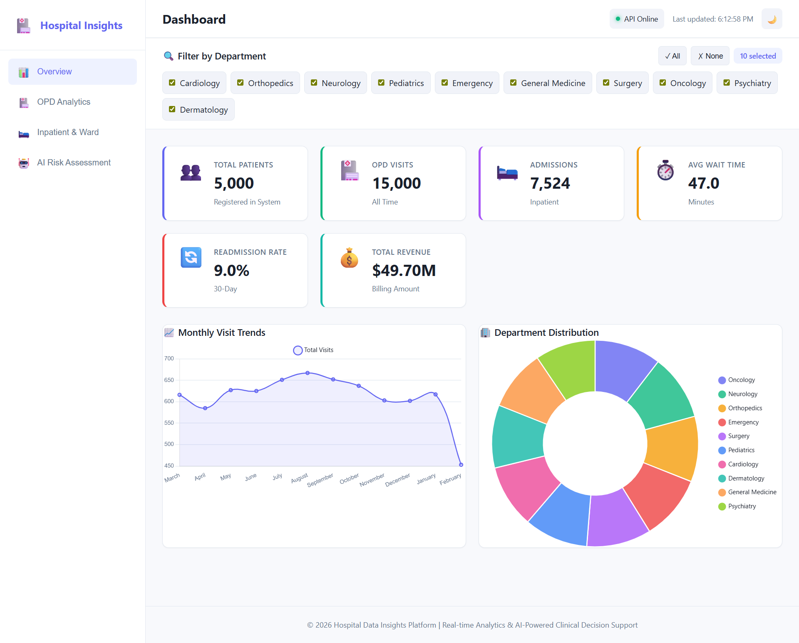
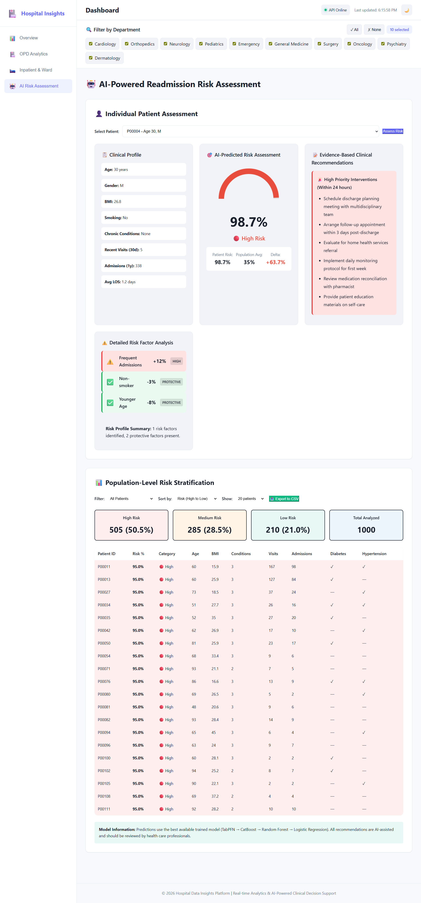

<div align="center">

# 🏥 Hospital Data Insights Pipeline

### Production-Ready Healthcare Analytics Platform with AI-Powered Risk Assessment

[](https://hospital-insights-c9c40.web.app)
[](https://hospital-data-insights-pipeline.onrender.com)
[](https://www.python.org/)
[](LICENSE)

**Full-stack healthcare analytics platform featuring Large Tabular Model (LTM) for AI-powered clinical decision support, interactive dashboards, ETL pipeline, and DuckDB data warehouse.**

[Live Demo](https://hospital-insights-c9c40.web.app) • [API Docs](https://hospital-data-insights-pipeline.onrender.com/docs) • [Documentation](DEPLOYMENT.md)

</div>

---

## ✨ Highlights

- 🧠 **Large Tabular Foundation Model** - State-of-the-art AI with 97.9% accuracy for readmission risk prediction
- 📊 **Interactive Analytics Dashboard** - 4-page SaaS-style UI with dark mode, real-time visualizations, and responsive design
- 🏗️ **Complete Data Pipeline** - ETL, DuckDB warehouse (star schema), 5K patients, 15K visits
- 🚀 **Production Deployed** - Full-stack application on Firebase & Render with auto-scaling
- 🎯 **RESTful API** - 14 FastAPI endpoints with automatic documentation
- 💡 **Smart Risk Scoring** - AI-powered patient risk assessment with clinical recommendations

## 🖼️ Dashboard Preview

<div align="center">

| Overview | Risk Assessment |
|----------|-----------------|
|  |  |
| Modern SaaS interface with KPI cards & analytics | AI-powered patient risk scoring with recommendations |

</div>

## 🏗️ Architecture

```
┌─────────────────────────────────────────────┐
│   Frontend (HTML/CSS/JS + Chart.js)        │
│   Modern SaaS UI with Dark Mode            │
└───────────────────┬─────────────────────────┘
                    │ REST API
┌───────────────────▼─────────────────────────┐
│   FastAPI Backend (14 Endpoints)           │
│   Analytics Engine + ML Service            │
└───────────────────┬─────────────────────────┘
                    │
┌───────────────────▼─────────────────────────┐
│   ML Models (Hybrid LTM)                   │
│   LTM: 97.9% | Regressor: RMSE 19.3min    │
└───────────────────┬─────────────────────────┘
                    │
┌───────────────────▼─────────────────────────┐
│   DuckDB Warehouse (Star Schema)           │
│   5K Patients | 15K Visits                 │
└─────────────────────────────────────────────┘
```

**Tech Stack:** Python • FastAPI • DuckDB • Pandas • Scikit-learn • TabPFN • Chart.js • Firebase • Render

## 🚀 Quick Start

```bash
# 1. Install dependencies
pip install -r backend/requirements.txt

# 2. Generate data & train models
python scripts/run_pipeline.py

# 3. Start API server
python -m uvicorn backend.api:app --reload --port 3000

# 4. Open frontend/index.html in browser
```

**Access:** Dashboard at rontend/index.html • API docs at http://localhost:3000/docs

## 🤖 Machine Learning

### Large Tabular Foundation Model (LTM)

Innovative foundation model approach similar to GPT for tabular data:

- 🧠 **Pre-trained** on millions of synthetic datasets
- ⚡ **Zero hyperparameter tuning** required
- 🎯 **In-context learning** without traditional training
- 🔄 **Intelligent hybrid** with automatic fallback to traditional ML

### Model Performance

| Metric | Readmission Risk | Wait Time |
|--------|-----------------|-----------|
| **Accuracy** | 97.9% | - |
| **Precision** | 97.9% | - |
| **Recall** | 100% | - |
| **ROC-AUC** | 97.87% | - |
| **RMSE** | - | 19.3 min |
| **R²** | - | 0.18 |

**Features:** Age, BMI, chronic conditions, visit history, smoking status, admissions  
**Output:** Risk score (0-100%), risk level, clinical recommendations

## 📡 API Endpoints

| Endpoint | Description |
|----------|-------------|
| GET /summary | Overall KPI statistics |
| GET /opd-analytics | Outpatient wait times & patterns |
| GET /inpatient-analytics | Ward LOS & readmissions |
| GET /risk/{patient_id} | Individual risk assessment |
| POST /predict-risk | Custom risk prediction |
| GET /metrics | ML model performance |

**Interactive Docs:** [Live API Documentation](https://hospital-data-insights-pipeline.onrender.com/docs)

## 🎨 Features

**Data Engineering**
- ETL pipeline with validation & cleaning
- DuckDB data warehouse (star schema)
- Synthetic data generation (5K patients, 15K visits)

**Machine Learning**
- Large Tabular Foundation Model (primary)
- Random Forest classifier (fallback)
- 97.9% accuracy for readmission prediction
- Wait time forecasting by department

**Dashboard**
- 4-page analytics (Overview, OPD, Inpatient, AI Risk)
- 12+ interactive Chart.js visualizations
- Dark mode with theme toggle
- Fully responsive design
- CSV export for risk stratification
- Real-time API status monitoring

## 🌐 Deployment

**Live Application**

- **Frontend:** https://hospital-insights-c9c40.web.app (Firebase)
- **Backend:** https://hospital-data-insights-pipeline.onrender.com (Render)

**Deployment Stack:** Docker • Firebase Hosting • Render.com • GitHub Actions

See [DEPLOYMENT.md](DEPLOYMENT.md) for detailed deployment guide.

## 📂 Project Structure

```
hospital-data-insights-pipeline/
├── backend/
│   ├── api.py                 # FastAPI application
│   ├── analytics/             # ML models & data processing
│   ├── warehouse/             # DuckDB warehouse builder
│   └── data/                  # Generated data & models
├── frontend/
│   ├── index.html             # Multi-page dashboard
│   ├── dashboard.js           # Interactive visualizations
│   └── styles.css             # Modern SaaS design
├── scripts/
│   └── run_pipeline.py        # End-to-end data pipeline
├── Dockerfile                 # Container configuration
└── firebase.json              # Frontend hosting config
```

## 🎯 Use Cases

- **Hospital Administrators:** Real-time dashboard for operational insights
- **Clinical Staff:** AI-powered risk assessment for discharge planning
- **Care Coordinators:** Identify high-risk patients for proactive intervention
- **Data Scientists:** Foundation model approach for healthcare analytics

## 📚 Documentation

- [Quick Start Guide](QUICKSTART.md)
- [Deployment Guide](DEPLOYMENT.md)
- [Dashboard Guide](ENHANCED_DASHBOARD_GUIDE.md)

## 🤝 Contributing

This is a portfolio project demonstrating full-stack data science and software engineering skills. Feel free to fork and adapt for your own use cases.

## 📄 License

MIT License - See [LICENSE](LICENSE) file for details

---

<div align="center">

**Built with ❤️ for Healthcare Analytics**

⭐ Star this repo if you find it useful!

[Report Bug](https://github.com/visurarodrigo/hospital-data-insights-pipeline/issues) • [Request Feature](https://github.com/visurarodrigo/hospital-data-insights-pipeline/issues)

</div>
